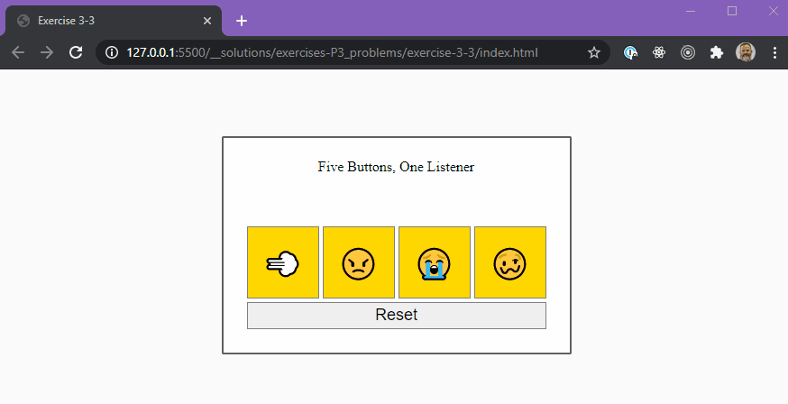
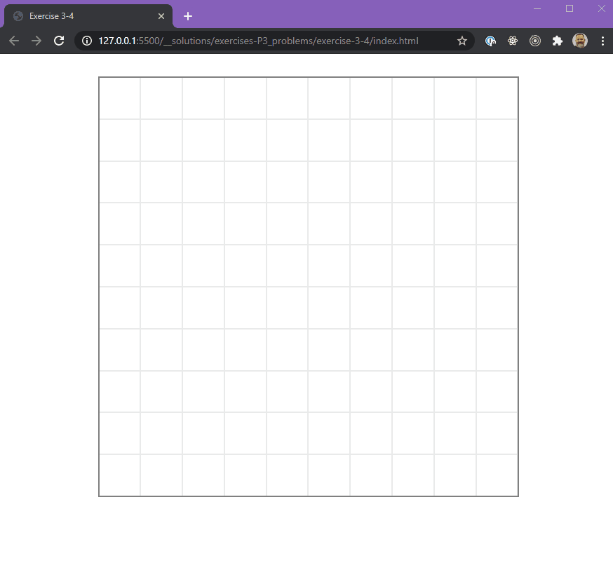

## Exercise 2 (2-1 to 2-5)

- You are only allowed to modify the `app.js` file, and perhaps the `index.html`.
- Look over the HTML file before beginning.
- The `app.js` file contains relevant hints.

### Exercise 2-1

There are 4 buttons that are supposed to do different things when clicked.

- button one disappears (initial opacity is `100`)
- button two turns 'crimson'
- button three turns 'lightblue'
- button four starts shaking... (animation provided in styles css as a class called `jitters`)

### Exercise 2-2

#### STEP 1

- Reimplement the functionality of `2-1` (Try to NOT look at your previous solution).

#### STEP 2

- This time the buttons should toggle.
- Meaning if the user clicks on them a second time, it should go back to initial state.
- Initial button color is `gold`.

### Exercise 2-3

#### STEP 1

- Reimplement the functionality of `2-1` and `2-2`

#### STEP 2

- There should be a RESET button that "resets" all of the buttons to their original state.

---

## Exercise 3

Create a game board. The CSS will, for the most part, take care of itself as long as you assign the right classes to the cells.

### Exercise 3-1 - The Grid

#### Objectives

- set the size of the board to a square of `600px`;
- set a number of cells per row;
- the cells should all be square.
- cells should have a class of `cell`
- cells should have and id of `cell-#`

### Exercise 3-2 - The Custom Grid (Stretch)

#### Objectives

- Use the grid code you wrote in 3-1
- Allow the user to create cells on the board based on values he/she inputs.
- Ask the user the number of `ROWS` and `COLUMNS`
- Use those values to generate a grid

